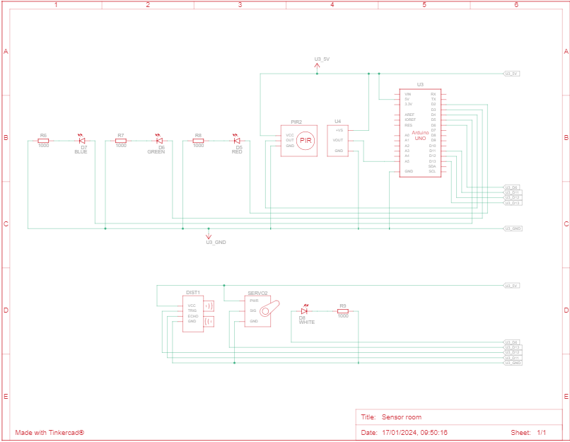

# SmartRoom
Projeto realizado dentro da cadeira de Introdução a Robótica, simulando um sistema ambiente indoor inteligente.
https://www.tinkercad.com/things/hHbspQZawFO-atividade-2/editel?sharecode=P9qWSPVysLJNI9onLQf-s5X1JrHhvgXxFc06WemDQf8&authuser=1

# Visão geral
Esse circuito consiste em criar um sistema para um ambiente indoor inteligente. Este ambiente deve conter as seguintes funcionalidades:
● Controle de acesso;
● Controle de temperatura;
● Controle de iluminação.
Cada funcionalidade deve ser pensada por meio da interação de um sensor com um atuador. Em outras palavras, o sensor deve realizar medições que serão processadas/avaliadas no Arduino. Dependendo do valor medido, sinais de controle diferentes devem ser enviados ao atuador.
Objetivos
O programa deverá, através dos seguintes controles:
● Controle de acesso;
● Controle de temperatura;
● Controle de iluminação.
Simular um ambiente inteligente, de acordo com as funcionalidades de cada sensor, de forma coerente e prática.

# Especificações
Foram utilizados, no tinkercad:
-1 resistor de 1000Ω
-1 led verde
-1 led amarelo
-1 led vermelho
-1 led branco

# Circuito
1- O circuito simula uma Smart Room de forma genérica e funcional. 
2-  A simulação começa com o sensor ultrassônico (HC-SR04)  e o servo motor ( Micro Servo), simulando uma porta com sensor de aproximação interligado.
3- Há outro sensor dentro do ambiente(PIR)  detectando presença que está interligado com a luz. Enquanto ele detectar presença a luz permanecerá ligada.
4- Por último há um sensor de Temperatura (TMP36) simulando um termômetro que indica 3 estágios de temperatura. Frio, ambiente e quente.

# Ferramentas Utilizadas
-Arduino UNO/C++

